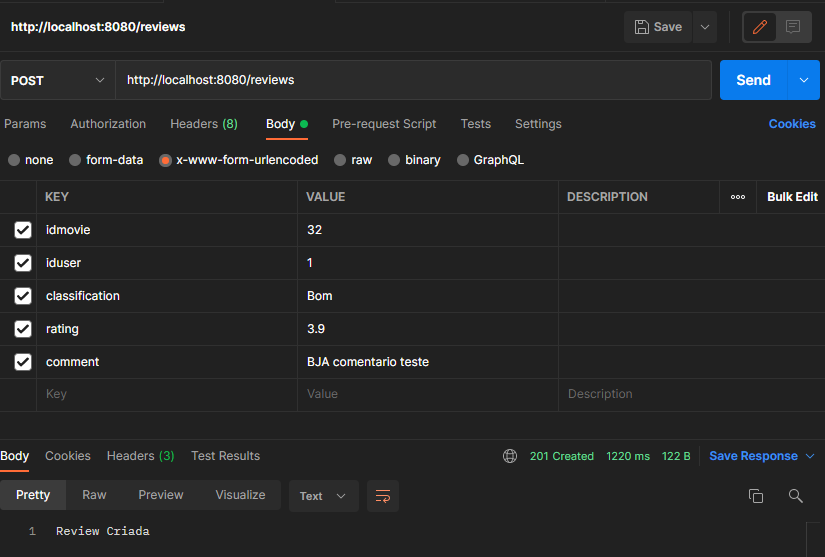
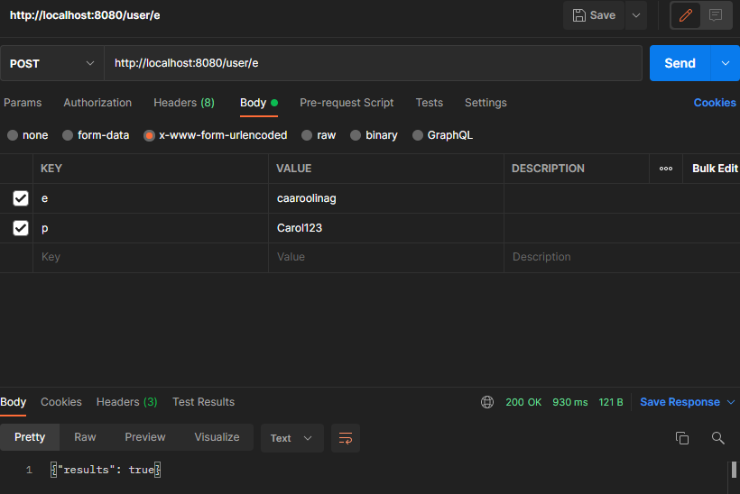

# Back-T3T4

JDK: openjdk-16 versão 16.0.2

# Projeto
Trata-se do uso do framework Ktor para linguagem Kotlin para criação de uma API que será utilizada na criação de um site de review para filmes

# Como iniciar
1. Baixar VM do DB modelo em: https://drive.google.com/file/d/1CeS3kiVsx_JEfJUNd6kVmlfN6rMJTlDx/view?usp=sharing
2. Importar a VM no VirtualBox
3. Iniciar a VM do banco de dados
4. Criar arquivo MariaDB.kt em src/main/java/config com o template de MariaDB.kt.template para conexão com o Banco de Dados
5. Preencher o arquivo com as seguintes informações:
```
    const val user = "admin"    
    const val password = "admin"    
    const val host = "{IP fornecido pela VM (print de exemplo abaixo)}"    
    const val port = "3306"
```

    
6. Iniciar a aplicação pelo arquivo main.kt

# Arquitetura
## [Clean Architecture](https://blog.cleancoder.com/uncle-bob/2012/08/13/the-clean-architecture.html)
### Estrutura:
    -src/
        |-main/
            |-java/
                |-config/ : configurações de projeto
                |-controllers/ : Onde é definido como o framework utiliza o usecase
                |-fabrics/ : fábricas de controladores, usecases, etc
                |-interfaces/ : qualquer interface usada globalmente na aplicação
                |-models/ : models usados na aplicação
                |-repositories/ : Conexões com DB, métodos de DBs, etc
                |-usecases/ : Onde são definidas as regras de negócio
                |-Init.kt : Configurações para inicialização da aplicação
                |-main.kt : Inicializa a aplicação
### Banco de dados

### Ordem de desenvolvimento
#### ANTES: Criar arquivo MariaDB.kt em src/main/java/config com o template de MariaDB.kt.template para conexão com o Banco de Dados
1. Criar método na interface de repositório (IRepo.kt)
2. Implementar o método nos DBs
3. Criar usecase (UCExemplo.kt)
4. Criar método na interface de controller (ICtrl.kt)
5. Implementar o método em um controlador (CExemplo.kt)
6. Adicionar o controlador do item 5. à fábrica de controladores (KtorControllerFabric.kt)
7. Criar rota que use o controlador em controllers.ktor.routers.routes
8. Implementar a rota no roteador (router.kt)

### Padronização de nomenclatura
* Arquivos: lowercase. ex: src
* Padrão: UpperCamelCase
* Classes: UpperCamelCase ex: Ktor
* Interfaces: I maiúsculo seguido do nome em UpperCamelCase. ex: IExemplo.kt
* Usecase: UC maiúsculo seguido do nome em UpperCamelCase. ex: UCExemplo.kt
* Controlador: C maiúsculo segudo do nome em UpperCamelCase. ex CExemplo.kt

### Rotas (Atualizado em 09/11 15:44)
#### Raiz
* http://localhost:8080/
#### Filmes
* GET "/movies?n=&t=&a=" : retorna lista com todos os filmes do Banco de Dados dado um filtro. (n = nome, t = tema, a = disponivel)
* GET "/movies/{id}" : retorna um filme do Banco de Dados dado seu id

#### Reviews
* GET "/reviews" : retorna lista com todas as reviews do Banco de Dados
* GET "/reviews/{idFilme}" : retorna do Banco de Dados uma lista com reviews de um filme, a partir do id do filme
* POST "/reviews" : Adiciona uma review ao Banco de Dados
  * Body:
    * type: `x-www-form-urlencoded` ou `multipart/form-data`
    * parameters:
        * `idmovie` : id do filme ao qual o review se refere
        * `iduser` : id do usuario criador da review
        * `classification` : classificação do filme, dado pelo usuário
        * `rating` : rating do filme, dado pelo usuário
        * `comment` : comentário da review
          * exemplo: idmovie=3&iduser=1&classification=bom&rating=8.9&comment=comentario
          

#### Usuarios
* POST "/user/e" : Verifica se o usuario existe no Banco de Dados
  * Body:
    * type: `x-www-form-urlencoded` ou `multipart/form-data`
    * parameters:
      * `e` : email
      * `p` : senha
        * exemplo: e=caaroolinag@gmail.com&p=Carol123  (Exemplo resulta em usuário válido)
        